= Babeltrace's contributor's guide
Jérémie Galarneau, Philippe Proulx
v0.1, 6 September 2017
:toc:
:toclevels: 5

This is a partial contributor's guide for the
http://diamon.org/babeltrace[Babeltrace] project. If you have any
questions that are not answered in this guide, please post them
on https://lists.lttng.org/cgi-bin/mailman/listinfo/lttng-dev[Babeltrace's mailing list].

== Object reference counting and lifetime

This section covers the rationale behind the design of Babeltrace's
object lifetime management.

Starting from Babeltrace 2.x, all publicly exposed objects inherit a
common base: `bt_object`. This base provides a number of facilities to
all objects, chief amongst which are lifetime management functions.

The reference count of all public objects is controlled by invoking the
`bt_get()` and `bt_put()` functions which respectively increment and
decrement an object's reference count.

As far as lifetime management in concerned, Babeltrace makes a clear
distinction between regular objects, which have a single parent, and
root objects, which don't.

=== The problem

Let us consider a problematic case to illustrate the need for this
distinction.

A user of the CTF Writer library declares a trace, which *has* a
stream class (the declaration of a stream) and that stream class, in
turn, *has* an event class (the declaration of an event).

Nothing prevents this user from releasing his reference on any one of
these objects in any order. However, all objects in the
__trace--stream class--event class__ hierarchy can be retrieved
from any other.

For instance, the user could discard his reference on both the event
class and the stream class, only keeping a reference on the trace. From
this trace reference, stream classes can be enumerated, providing the
user with a new reference to the stream class he discarded earlier.
event classes can also be enumerated from stream classes, providing the
user with references to the individual event classes.

Conversely, the user could also hold a reference to an event class and
retrieve its parent stream class. The trace, in turn, can then be
retrieved from the stream class.

This example illustrates what could be interpreted as a circular
reference dependency existing between these objects. Of course, if the
objects in such a scenario were to hold references to each other (in
both directions), we would be in presence of a circular ownership
resulting in a leak of both objects as their reference counts would
never reach zero.

Nonetheless, the API must offer the guarantee that holding a node to any
node of the graph keeps all other reachable nodes alive.

=== The solution

The scheme employed in Babeltrace to break this cycle consists in the
"children" holding *reverse component references* to their parents. That
is, in the context of the trace IR, that event classes hold a reference
to their parent stream class and stream classes hold a reference to
their parent trace.

On the other hand, parents hold *claiming aggregation references* to
their children. A claiming aggregation reference means that the object
being referenced should not be deleted as long as the reference still
exists. In this respect, it can be said that parents truly hold the
ownership of their children, since they control their lifetime.
Conversely, the reference counting mechanism is leveraged by children to
notify parents that no other child indirectly exposes the parent.

When a parented object's reference count reaches zero, it invokes
`bt_put()` on its parent and does **not** free itself. However, from
that point, the object depends on its parent to signal the moment when
it can be safely reclaimed.

The invocation of `bt_put()` by the last children holding a reference to
its parent might trigger a cascade of `bt_put()` from child to parent.
Eventually, a **root** object is reached. At that point, if this
orphaned object's reference count reaches zero, the object invokes the
destructor method defined by everyone of its children as part of their
base `struct bt_object`. The key point here is that the cascade of
destructor will necessarily originate from the root and propagate in
preorder to the children. These children will propagate the destruction
to their own children before reclaiming their own memory. This ensures
that a node's pointer to its parent is *always* valid since the parent
has the responsibility of tearing-down their children before cleaning
themselves up.

Assuming a reference to an object is *acquired* by calling `bt_get()`
while its reference count is zero, the object acquires, in turn, a
reference on its parent using `bt_get()`. At that point, the child can
be thought of as having converted its weak reference to its parent into
a regular reference. That is why this reference is referred to as a
*claiming* aggregation reference.

=== Caveats

This scheme imposes a number of strict rules defining the relation
between objects:

* Objects may only have one parent.
* Objects, beside the root, are only retrievable from their direct
  parent or children.

=== Example

The initial situation is rather simple: **User A** is holding a
reference to a trace, **TC1**. As per the rules previously enounced,
stream classes **SC1** and **SC2** don't hold a reference to **TC1**
since their own reference counts are zero. The same holds true for
**EC1**, **EC2** and **EC3** with respect to **SC1** and **SC2**.

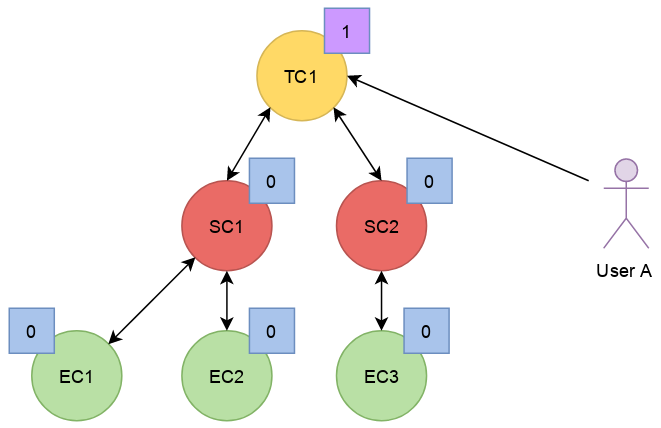

In this second step, we can see that **User A** has acquired a reference
on **SC2** through the trace, **TC1**.

The stream class's reference count transitions from zero to one,
triggering the acquisition of a strong reference on **TC1** from
**SC2**.

Hence, at this point, the trace's ownership is shared by **User A** and
**SC2**.

Next, **User A** acquires a reference on the **EC3** event class through
its parent stream class, **SC2**. Again, the transition of an object's
reference count from 0 to 1 triggers the acquisition of a reference on
its parent.

Note that SC2's reference count was incremented to 2. The trace's
reference count remains unchanged.

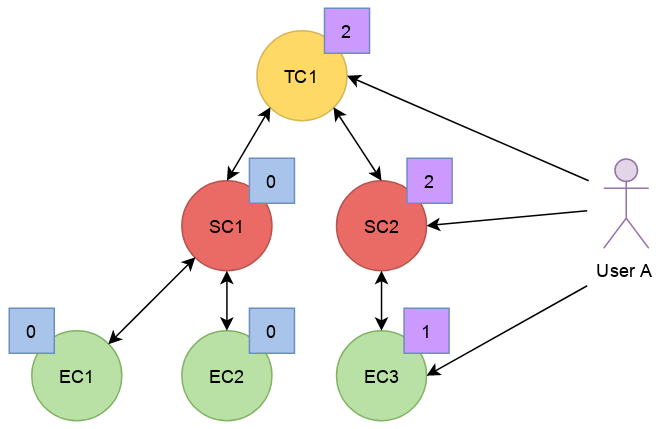

**User A** decides to drop its reference on **SC2**. **SC2**'s reference
count returns back to 1, everything else remaining unchanged.

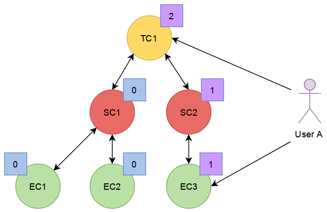

**User A** can then decide to drop its reference on the trace. This
results in a reversal of the initial situation: **User A** now owns an
event, **EC3**, which is keeping everything else alive and reachable.

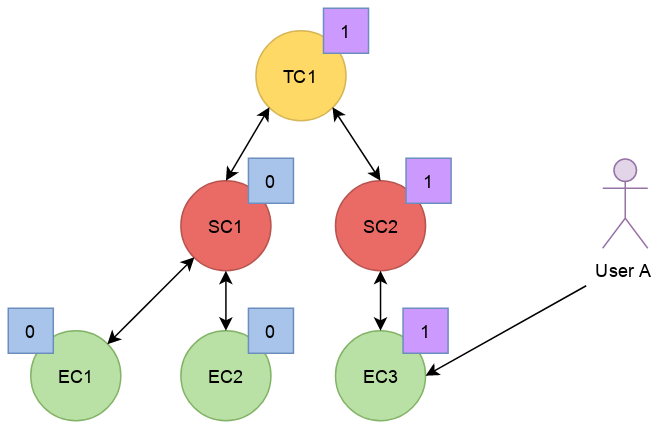

If another object, **User B**, enters the picture and acquires a
reference on the **SC1** stream class, we see that **SC1**'s reference
count transitioned from 0 to 1, triggering the acquisition of a
reference on **TC1**.

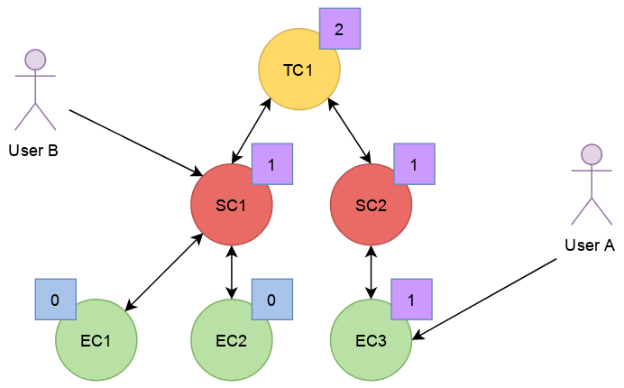

**User B** hands off a reference to **EC1**, acquired through **SC1**,
to another object, **User C**. The acquisition of a reference on
**EC1**, which transitions from 0 to 1, triggers the acquisition of a
reference on its parent, **SC1**.

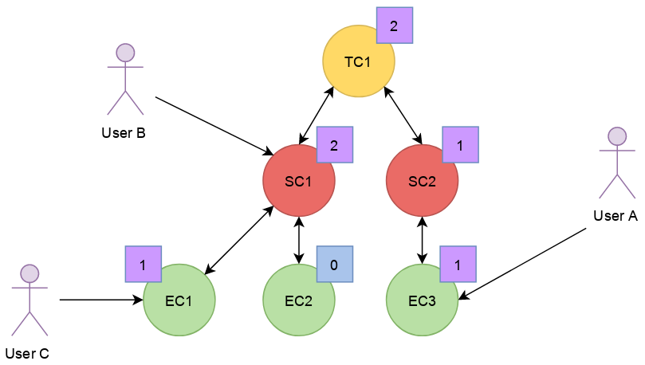

At some point, **User A** releases its reference on **EC3**. Since
**EC3**'s reference count transitions to zero, it releases its reference
on **SC2**. **SC2**'s reference count, in turn, reaches zero and it
releases its reference to **TC1**.

**TC1**'s reference count is now 1 and no further action is taken.

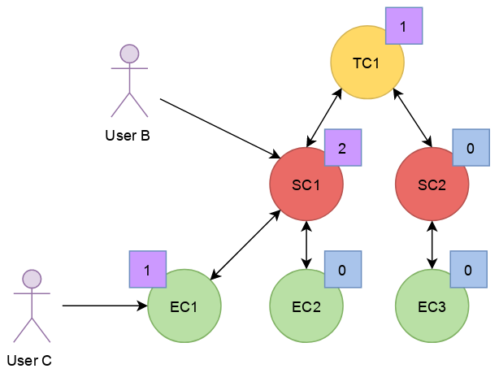

**User B** releases its reference on **SC1**. **User C** becomes the
sole owner of the whole hierarchy through his ownership of **EC1**.

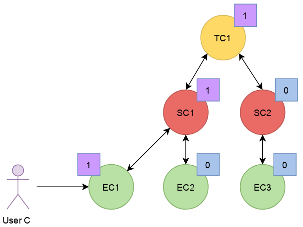

Finally, **User C** releases his ownership of **EC1**, triggering the
release of the whole hierarchy. Let's walk through the reclamation of
the whole graph.

Mirroring what happened when **User A** released its last reference on
**EC3**, the release of **EC1** by **User C** causes its reference count
to fall to zero.

This transition to zero causes **EC1** to release its reference on
**SC1**. **SC1**'s reference count reaching zero causes it to release
its reference on **TC1**.

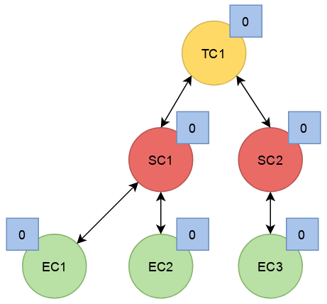

Since the reference count of **TC1**, a root object, has reached zero,
it invokes the destructor method on its children. This method is
recursive and causes the stream classes to call the destructor method on
their event classes.

The event classes are reached and, having no children of their own, are
reclaimed.

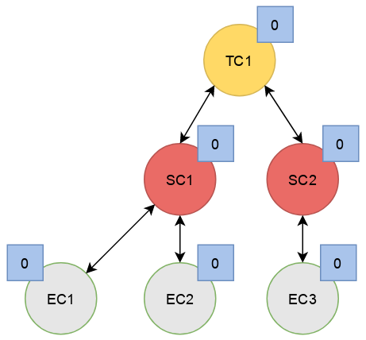

The stream classes having destroyed their children, are then reclaimed
by the trace.

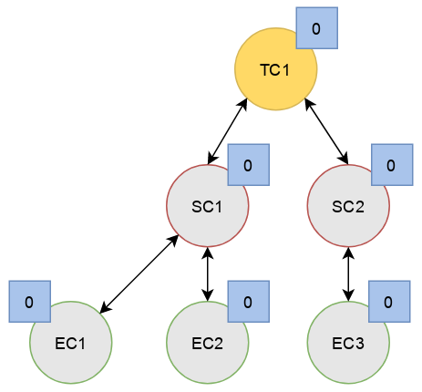

Finally, the stream classes having been reclaimed, **TC1** is reclaimed.

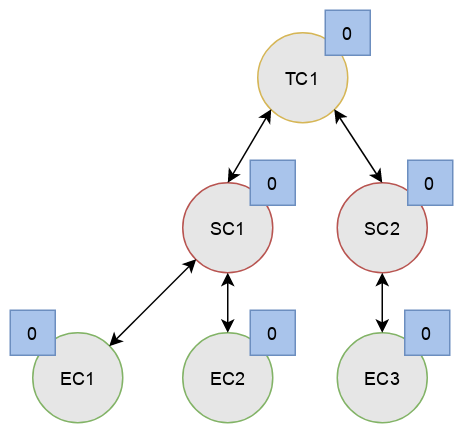

== Valgrind

To use Valgrind on an application (for example, the CLI or a test) which
loads libbabeltrace, use:

    $ G_SLICE=always-malloc G_DEBUG=gc-friendly PYTHONMALLOC=malloc \
      BABELTRACE_NO_DLCLOSE=1 valgrind --leak-check=full \
      --suppressions=/path/to/babeltrace/extras/valgrind/popt.supp app

`G_SLICE=always-malloc` and `G_DEBUG=gc-friendly` is for GLib and
`PYTHONMALLOC=malloc` is for the Python interpreter, if it is used by
the Python plugin provider (Valgrind will probably show a lot of errors
which originate from Python interpreter anyway).

`BABELTRACE_NO_DLCLOSE=1` makes libbabeltrace not close the shared
libraries (plugins) which it loads. This is needed to see the
appropriate backtrace when Valgrind shows errors.

== Logging

Logging is a great instrument for a developer to be able to collect
information about a running software.

Babeltrace is a complex software with many layers. When a Babeltrace
graph fails to run, what caused the failure? It could be caused by any
component, any notification iterator, and any deeply nested validation
of a CTR IR object, for example. With the appropriate logging statements
manually placed in the source code, we can find the cause of a bug
faster.

While <<log-level,care must be taken>> when placing _INFO_ to _FATAL_
logging statements, you should liberally instrument your Babeltrace
module with _DEBUG_ and _VERBOSE_ logging statements to help future you
and other developers understand what's happening at run-time.

=== Logging API

The Babeltrace logging API is internal: it is not exposed to the users
of the library, only to their developers. The only thing that a library
user can control is the current log level of the library itself with
`bt_logging_set_global_level()` and the initial library's log level with
the `BABELTRACE_LOGGING_GLOBAL_LEVEL` environment variable.

This API is based on https://github.com/wonder-mice/zf_log[zf_log], a
lightweight, yet featureful, MIT-licensed core logging library for C and
$$C++$$. The zf_log source files were modified to have the `BT_` and
`bt_` prefixes, and other small changes, like color support.

The logging functions are implemented in the logging convenience
library (`logging` directory).

==== Headers

The logging API headers are:

`<babeltrace/logging.h>`::
    Public header which a library user can use to control and read
    libbabeltrace's current log level.

`<babeltrace/logging-internal.h>`::
    Internal, generic logging API which you can use in any Babeltrace
    subproject. This is the translation of `zf_log.h`.

`<babeltrace/lib-logging-internal.h>`::
    Specific internal header to use within the library. This header
    defines `BT_LOG_OUTPUT_LEVEL` to a custom, library-wide hidden
    symbol which is the library's current log level before including
    `<babeltrace/logging-internal.h>`.

Do not include `<babeltrace/logging-internal.h>` or
`<babeltrace/lib-logging-internal.h>` in a header which contains logging
statements: this header could be included in source files which define a
different <<choose-a-tag,tag>>, for example. See
<<logging-instrument-header, Instrument a C header file>>.

==== Log levels

The API offers the following log levels:

* _VERBOSE_
* _DEBUG_
* _INFO_
* _WARN_
* _ERROR_
* _FATAL_

See <<log-level,how to decide which one to use>> below.

There are two important log level variables:

[[build-time-log-level]]Build-time, minimal log level::
    The minimal log level, or build-time log level, is set at build
    time and determines the minimal log level which can be executed.
    This applies to all the subprojects and modules (CLI, library,
    plugins, etc.).
+
All the logging statements with a level below this level are **not built
at all**. All the logging statements with a level equal to or greater
than this level _can_ be executed, depending on the
<<run-time-log-level,run-time log level>>.
+
You can set this level at configuration time with the
`BABELTRACE_MINIMAL_LOG_LEVEL` environment variable, for example:
+
--
----
$ BABELTRACE_MINIMAL_LOG_LEVEL=WARN ./configure
----
--
+
The default build-time log level is `VERBOSE`. For optimal performance,
set it to `NONE`, which effectively disables all logging in all the
Babeltrace subprojects.
+
The library's public API provides `bt_logging_get_minimal_level()` to
get the configured minimal log level.

[[run-time-log-level]]Run-time, dynamic log level::
    The dynamic log level is set at run-time and determines the current,
    active log level. All the logging statements with a level below this
    level are not executed, but they evaluate the condition. All the
    logging statements with a level equal to or greater than this level
    are executed, provided that their level is also
    <<build-time-log-level,enabled at build time>>.
+
`zf_log` has a concept of a global run-time log level which uses the
`_bt_log_global_output_lvl` symbol. In practice, we never use this
symbol, and always make sure that `BT_LOG_OUTPUT_LEVEL` is defined to a
module-wise or subproject-wise hidden symbol before including
`<babeltrace/logging-internal.h>`. In the library,
`<babeltrace/lib-logging-internal.h>` does this job: just include this
header which defines `BT_LOG_OUTPUT_LEVEL` to the appropriate symbol
before it includes `<babeltrace/logging-internal.h>`. In plugins, for
example, there is one log level per component class, which makes log
filtering easier during execution.
+
In libbabeltrace, the user can set the current run-time log level with
the `bt_logging_set_global_level()` function, for example:
+
--
[source,c]
----
bt_logging_set_global_level(BT_LOGGING_LEVEL_INFO);
----
--
+
The library's initial run-time log level is defined by the
`BABELTRACE_LOGGING_GLOBAL_LEVEL` environment variable (`VERBOSE`, `DEBUG`,
`INFO`, `WARN`, `ERROR`, `FATAL`, or `NONE`), or set to _NONE_ if this
environment variable is undefined.
+
Other subprojects have their own way of setting their run-time log
level. For example, the CLI uses the `BABELTRACE_CLI_LOG_LEVEL`
environment variable, and the `filter.utils.muxer` component class
initializes its log level thanks to the
`BABELTRACE_PLUGIN_UTILS_MUXER_FLT_LOG_LEVEL` environment variable
(also _NONE_ by default).
+
Make sure that there is a documented way to initialize or modify the
log level of your subproject or module, and that it's set to _NONE_
by default.

[[logging-statements]]
==== Logging statement macros

The Babeltrace logging statement macros work just like `printf()` and
contain their log level in their name:

`BT_LOGV("format string", ...)`::
    Standard verbose logging statement.

`BT_LOGD("format string", ...)`::
    Standard debug logging statement.

`BT_LOGI("format string", ...)`::
    Standard info logging statement.

`BT_LOGW("format string", ...)`::
    Standard warning logging statement.

`BT_LOGE("format string", ...)`::
    Standard error logging statement.

`BT_LOGF("format string", ...)`::
    Standard fatal logging statement.

`BT_LOGV_MEM(data_ptr, data_size, "format string", ...)`::
    Memory verbose logging statement.

`BT_LOGD_MEM(data_ptr, data_size, "format string", ...)`::
    Memory debug logging statement.

`BT_LOGI_MEM(data_ptr, data_size, "format string", ...)`::
    Memory info logging statement.

`BT_LOGW_MEM(data_ptr, data_size, "format string", ...)`::
    Memory warning logging statement.

`BT_LOGE_MEM(data_ptr, data_size, "format string", ...)`::
    Memory error logging statement.

`BT_LOGF_MEM(data_ptr, data_size, "format string", ...)`::
    Memory fatal logging statement.

`BT_LOGV_ERRNO("initial message", "format string", ...)`::
	`errno` string verbose logging statement.

`BT_LOGD_ERRNO("initial message", "format string", ...)`::
	`errno` string debug logging statement.

`BT_LOGI_ERRNO("initial message", "format string", ...)`::
	`errno` string info logging statement.

`BT_LOGW_ERRNO("initial message", "format string", ...)`::
	`errno` string warning logging statement.

`BT_LOGE_ERRNO("initial message", "format string", ...)`::
	`errno` string error logging statement.

`BT_LOGF_ERRNO("initial message", "format string", ...)`::
	`errno` string fatal logging statement.

`BT_LOGV_STR("preformatted string")`::
    Preformatted string verbose logging statement.

`BT_LOGD_STR("preformatted string")`::
    Preformatted string debug logging statement.

`BT_LOGI_STR("preformatted string")`::
    Preformatted string info logging statement.

`BT_LOGW_STR("preformatted string")`::
    Preformatted string warning logging statement.

`BT_LOGE_STR("preformatted string")`::
    Preformatted string error logging statement.

`BT_LOGF_STR("preformatted string")`::
    Preformatted string fatal logging statement.

==== Conditional logging

`BT_LOG_IF(cond, statement)`::
    Execute `statement` only if `cond` is true.
+
Example:
+
--
[source,c]
----
BT_LOG_IF(i < count / 2, BT_LOGD("Log this: i=%d", i));
----
--

To check the <<build-time-log-level,build-time log level>>:

[source,c]
----
#if BT_LOG_ENABLED_DEBUG
...
#endif
----

This tests if the _DEBUG_ level was enabled at build-time. This means
that the current, <<run-time-log-level,dynamic log level>> _could_ be
_DEBUG_, but it could also be higher. The rule of thumb is to use only
logging statements at the same level in a `BT_LOG_ENABLED_*` conditional
block.

The available definitions for build-time conditions are:

* `BT_LOG_ENABLED_VERBOSE`
* `BT_LOG_ENABLED_DEBUG`
* `BT_LOG_ENABLED_INFO`
* `BT_LOG_ENABLED_WARN`
* `BT_LOG_ENABLED_ERROR`
* `BT_LOG_ENABLED_FATAL`

To check the current, <<run-time-log-level,run-time log level>>:

[source,c]
----
if (BT_LOG_ON_DEBUG) {
    ...
}
----

This tests if the _DEBUG_ log level is dynamically turned on
(implies that it's also enabled at build-time). This check could have a
noticeable impact on performance.

The available definitions for run-time conditions are:

* `BT_LOG_ON_VERBOSE`
* `BT_LOG_ON_DEBUG`
* `BT_LOG_ON_INFO`
* `BT_LOG_ON_WARN`
* `BT_LOG_ON_ERROR`
* `BT_LOG_ON_FATAL`

Those macros check the subproject-specific or module-specific log level
symbol (defined by `BT_LOG_OUTPUT_LEVEL`).

Never, ever write code which would be executed only to compute the
fields of a logging statement outside a conditional logging scope,
for example:

[source,c]
----
int number = get_number_of_event_classes_with_property_x(...);
BT_LOGD("Bla bla: number=%d", number);
----

Do this instead:

[source,c]
----
if (BT_LOG_ON_DEBUG) {
    int number = get_number_of_event_classes_with_property_x(...);
    BT_LOGD("Bla bla: number=%d", number);
}
----

Or even this:

[source,c]
----
BT_LOGD("Bla bla: number=%d", get_number_of_event_classes_with_property_x(...));
----

[[how-to]]
=== Instrument a module

Follow those steps to make your module loggable:

. In your module's root directory, create a `logging.c` file with
  this content:
+
--
[source,c]
----
/*
 * Copyright (c) 2017 EfficiOS Inc. <http://efficios.com/>
 *
 * Permission is hereby granted, free of charge, to any person obtaining a copy
 * of this software and associated documentation files (the "Software"), to deal
 * in the Software without restriction, including without limitation the rights
 * to use, copy, modify, merge, publish, distribute, sublicense, and/or sell
 * copies of the Software, and to permit persons to whom the Software is
 * furnished to do so, subject to the following conditions:
 *
 * The above copyright notice and this permission notice shall be included in
 * all copies or substantial portions of the Software.
 *
 * THE SOFTWARE IS PROVIDED "AS IS", WITHOUT WARRANTY OF ANY KIND, EXPRESS OR
 * IMPLIED, INCLUDING BUT NOT LIMITED TO THE WARRANTIES OF MERCHANTABILITY,
 * FITNESS FOR A PARTICULAR PURPOSE AND NONINFRINGEMENT. IN NO EVENT SHALL THE
 * AUTHORS OR COPYRIGHT HOLDERS BE LIABLE FOR ANY CLAIM, DAMAGES OR OTHER
 * LIABILITY, WHETHER IN AN ACTION OF CONTRACT, TORT OR OTHERWISE, ARISING FROM,
 * OUT OF OR IN CONNECTION WITH THE SOFTWARE OR THE USE OR OTHER DEALINGS IN THE
 * SOFTWARE.
 */

#define BT_LOG_OUTPUT_LEVEL my_module_log_level
#include <babeltrace/logging-internal.h>

BT_LOG_INIT_LOG_LEVEL(my_module_log_level, "BABELTRACE_MY_MODULE_LOG_LEVEL");
----
--
+
Replace `my_module_log_level` with the name of the symbol which holds
the log level for your module (should be unique amongst all the log level
symbols of the project). Replace `BABELTRACE_MY_MODULE_LOG_LEVEL` with
the name of the environment variable from which to initialize your
module's log level at construction time. `BT_LOG_INIT_LOG_LEVEL()`
defines both the hidden log level symbol and a constructor which reads
the environment variable and sets the log level symbol accordingly.

. In your module's root directory, create a `logging.h` file with
  this content:
+
--
[source,c]
----
#ifndef BABELTRACE_MY_MODULE_LOGGING_H
#define BABELTRACE_MY_MODULE_LOGGING_H

/*
 * Copyright (c) 2017 EfficiOS Inc. <http://efficios.com/>
 *
 * Permission is hereby granted, free of charge, to any person obtaining a copy
 * of this software and associated documentation files (the "Software"), to deal
 * in the Software without restriction, including without limitation the rights
 * to use, copy, modify, merge, publish, distribute, sublicense, and/or sell
 * copies of the Software, and to permit persons to whom the Software is
 * furnished to do so, subject to the following conditions:
 *
 * The above copyright notice and this permission notice shall be included in
 * all copies or substantial portions of the Software.
 *
 * THE SOFTWARE IS PROVIDED "AS IS", WITHOUT WARRANTY OF ANY KIND, EXPRESS OR
 * IMPLIED, INCLUDING BUT NOT LIMITED TO THE WARRANTIES OF MERCHANTABILITY,
 * FITNESS FOR A PARTICULAR PURPOSE AND NONINFRINGEMENT. IN NO EVENT SHALL THE
 * AUTHORS OR COPYRIGHT HOLDERS BE LIABLE FOR ANY CLAIM, DAMAGES OR OTHER
 * LIABILITY, WHETHER IN AN ACTION OF CONTRACT, TORT OR OTHERWISE, ARISING FROM,
 * OUT OF OR IN CONNECTION WITH THE SOFTWARE OR THE USE OR OTHER DEALINGS IN THE
 * SOFTWARE.
 */

#define BT_LOG_OUTPUT_LEVEL my_module_log_level
#include <babeltrace/logging-internal.h>

BT_LOG_LEVEL_EXTERN_SYMBOL(my_module_log_level);

#endif /* BABELTRACE_MY_MODULE_LOGGING_H */
----
--
+
Replace `my_module_log_level` with the name of your module's
log level symbol.

. Include the `logging.c` and `logging.h` in the `_SOURCES` variable
  of your module's object in your module's root `Makefile.am`.

. Add the log level initializing environment variable name to the
  `log_level_env_var_names` array in `cli/babeltrace.c`.

[[logging-instrument-source]]
==== Instrument a C source file

To instrument a C source file (`.c`):

. At the top of the file, before the first `#include` line (if any),
  define your file's tag name and include the local `logging.h`:
+
--
[source,c]
----
#define BT_LOG_TAG "MY-MODULE-MY-FILE"
#include "logging.h"
----
--
+
A logging tag name is a namespace for a specific source file. Its name
is part of every log message generated by the statements of the file. A
logging tag name _must_ be only uppercase letters, digits, and the
hyphen (`-`) character. See <<choose-a-tag,Choose a tag>> for
a list of standard tags.

. Use the <<logging-statements,logging statement macros>> in the file's
  functions to instrument it.

[[logging-instrument-header]]
==== Instrument a C header file

To instrument a C header file (`.h`), if you have `static inline`
functions in it:

. Do not include any logging header.
. Use the <<logging-statements,logging statement macros>> in the file's
  functions to instrument it, making each of them conditional to the
  existence of the macro you're using:
+
--
[source,c]
----
static inline
void some_function(void)
{
    /* ... */

#ifdef BT_LOGV
    BT_LOGV(...);
#endif

    /* ... */

#ifdef BT_LOGW_STR
    BT_LOGW_STR(...);
#endif

    /* ... */
}
----
--
+
The C source files which include this header file determine if logging
is enabled or not for them (if the source file is instrumented itself),
and the tag of the included header's logging statement is the same as
the including C source file.

[[choose-a-tag]]
=== Choose a tag

For plugins, the format of the tag name for a given source file _must_
be:

[verse]
PLUGIN-__PNAME__-__CCNAME__-__CCTYPE__[-__FILE__]

__PNAME__::
    Plugin's name.

__CCNAME__::
    Component class's name.

__CCTYPE__::
    Component class's type (`SRC`, `FLT`, or `SINK`).

__FILE__::
    Additional information to specify the source file name or module.

Examples:

* `PLUGIN-CTF-LTTNG-LIVE-SRC`
* `PLUGIN-CTF-LTTNG-LIVE-SRC-VIEWER`
* `PLUGIN-UTILS-MUXER-FLT`

[[log-level]]
=== Choose a log level

Choosing the appropriate level for your logging statement is very
important.

[options="header,autowidth",cols="default,default,asciidoc,default"]
|===
|Log level |Description |Use cases |Impact on performance

|_FATAL_
|The program, library, or plugin cannot continue to work in this
condition: it must be terminated immediately.

A _FATAL_-level logging statement should always be followed by
`abort()`.
|
* Unexpected return values from system calls.
* Logic error in internal code, for example an unexpected value in a
  `switch` statement.
|Almost none: should be executed in production.

|_ERROR_
|An important error which is somewhat not fatal, that is, the program,
library, or plugin can continue to work after this, but you judge that
it should be reported to the user.

Usually, the program cannot recover from such an error, but it can at
least exit cleanly.
|
* Memory allocation errors.
* Failed to perform an operation which should work considering the
  implementation and the satisfied preconditions. For example, the
  failure to create an empty object (no parameters): most probably
  failed internally because of an allocation error.
* Almost any error in terminal elements: CLI and plugins.
|Almost none: should be executed in production.

|_WARN_
|A logic error which still allows the execution to continue.

_WARN_-level logging statements are for any error or weird action that
is directly or indirectly caused by the user. For example, not having
enough memory is considered beyond the user's control, so we always
log memory errors with an _ERROR_ level (not _FATAL_ because we usually
don't abort in this condition).

Almost all the library's errors are logged as warnings because they are
caused by the user.
|
* Not honoring a public function's preconditions (NULL parameters,
  index out of bounds, etc.).
* Adding an invalid event class to a stream class which is already
  part of a trace.
+
For example, the caller tries to set a property of a frozen stream
class.
|Almost none: can be executed in production.

|_INFO_
|Any useful information which a non-developer user would understand.
|
* Successful loading of a plugin (with name, version, etc.).
* Successful connection to or disconnection from another system.
* An _optional_ subsystem cannot be loaded.
|Very little: can be executed in production if
_INFO_ level information is desired.

|_DEBUG_
|Something that only Babeltrace developers would be interested into.
|
* High-level function entry/exit.
* Object creation, destruction, copying, and freezing.
* The result of some computation/validation which does not
  occur in a tight loop.
|Noticeable, but not as much as the _VERBOSE_ level: not executed in
production.

|_VERBOSE_
|Low-level debugging context information. More appropriate for tracing
in general.
|
* Reference count change.
* Status of each iteration of a loop.
* State machine's state change.
* Data structure lookup/modification.
* List of ELF sections found in a plugin.
* Get or set an object's property.
* Object comparison's intermediate results.
|Huge: not executed in production.
|===

Make sure not to use a _WARN_ (or higher) log level when the condition
leading to the logging statement can occur under normal circumstances.
For example, a public function to get some object or property from an
object by name or key that fails to find the value is not a warning: the
user could legitimately use this function to check if the name/key
exists in the object. In this case, use the _VERBOSE_ level (or do not
log at all). If a numeric index is out of bounds, however, this
qualifies for a _WARN_ level: such API functions have documented
preconditions that the index must be in bounds (the user can always
check with a count or size function).

[[message]]
=== Write an appropriate message

Follow those rules when you write a logging statement's message:

* Use an english sentence which starts with a capital letter. Start the
  sentence with the appropriate verb tense depending on the context. For
  example:
+
--
** Beginning of operation (present continuous): _Creating ..._,
   _Copying ..._, _Serializing ..._, _Freezing ..._, _Destroying ..._
** End of operation (simple past): _Created ..._, _Successfully created ..._,
   _Failed to create ..._, _Set ..._ (simple past of _to set_ which is
   also _set_)
--
+
For warning and error messages, you can start the message with _Cannot_
or _Failed to_ followed by a verb if it's appropriate.

* Do not include the log level in the message itself. For example,
  do not start the message with _Error while_ or _Warning:_.

* Do not put newlines, tabs, or other special characters in the
  message, unless you want to log a string with such characters. Note
  that multiline log messages can be hard to parse, analyze, and filter,
  however, so prefer multiple `BT_LOG*()` statements over a single
  statement with newlines.

* **If there are fields that your logging statement must record**,
  follow the message with `:` followed by a space, then with the list of
  fields (more about this below). If there are no fields, end the
  sentence with a period.

The statement's fields _must_ be a comma-separated list of
+__name__=__value__+ tokens. Keep +__name__+ as simple as possible
(lowercase if possible). If +__value__+ is a non-alphanumeric string,
put it between double quotes. Always use the `PRId64` and `PRIu64`
specifiers when logging `int64_t` and `uint64_t` values.

Example:

    "Cannot add event class to stream class: stream-class-addr=%p, "
    "stream-class-name=\"%s\", stream-class-id=%" PRId64 ", "
    "event-class-addr=%p, event-class-name=\"%s\", event-class-id=%" PRId64

By following a standard format for the statement fields, it is easier
to use tools like https://www.elastic.co/products/logstash[Logstash]
to split fields and analyze logs.

Prefer the following suffixes in field names:

[options="header,autowidth"]
|===
|Field name suffix |Description |Format specifier

|`-addr` |Memory address |`%p`
|`-fd` |File descriptor |`%d`
|`-fp` |File stream (`FILE *`) |`%p`
|`-id` |Object's ID |`%" PRId64 "` or `%" PRIu64 "`
|`-name` |Object's name |`\"%s\"`
|===

=== Output

The log is printed to the standard error stream. A log line contains the
time, the process and thread IDs, the <<log-level,log level>>, the
<<choose-a-tag,tag>>, the source's function name, file name and
line number, and the <<message,message>>.

When Babeltrace supports terminal color codes (depends on the
`BABELTRACE_TERM_COLOR` environment variable's value and what the
standard output and error streams are plugged into), _INFO_-level lines
are blue, _WARN_-level lines are yellow, and _ERROR_-level and
_FATAL_-level lines are red.

Log line example:

    05-11 00:58:03.691 23402 23402 D VALUES bt_value_destroy@values.c:498 Destroying value: addr=0xb9c3eb0

You can easily filter the log with `grep` or `ag`. For example, to
keep only the _WARN_-level log messages that the `VALUES` module
generates:

    $ export BABELTRACE_LOGGING_GLOBAL_LEVEL=VERBOSE
    $ ./test_ctf_writer_complete 2>&1 | ag 'W VALUES'
