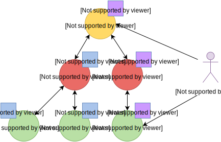
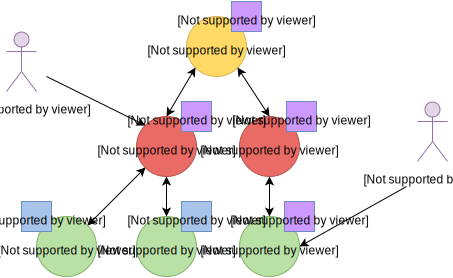
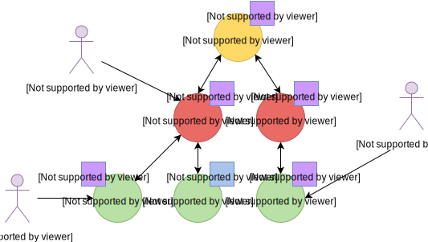
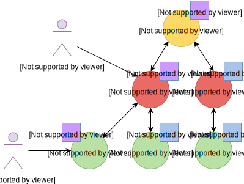
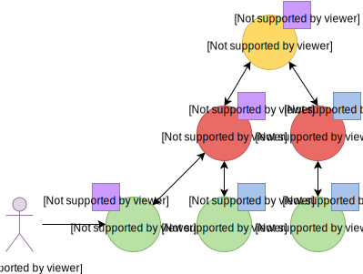
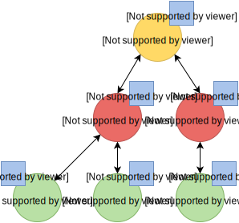
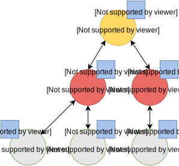
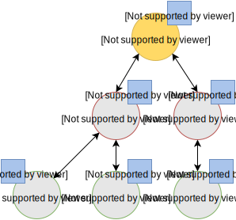
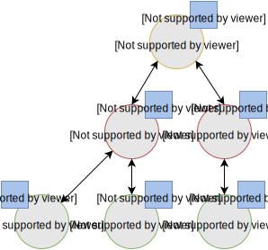

# Babeltrace Object Reference Counting and Lifetime

This document covers the rationale behind the design of Babeltrace's object
lifetime management.

Starting from Babeltrace 2.x, all publicly exposed objects inherit a common
base: bt_object. This base provides a number of facilities to all objects, chief
amongst which are lifetime management functions.

The reference count of all public objects is controlled by invoking
the `bt_get()` and `bt_put()` functions which respectively
increment and decrement an object's reference count.

As far as lifetime management in concerned, Babeltrace makes a clear
distinction between regular objects, which have a single parent, and root
objects, which don't.

## The Problem

Let us consider a problematic case to illustrate the need for this
distinction.

A user of the CTF Writer library declares a Trace, which *has* a
Stream Class (the declaration of a stream) and that Stream Class, in
turn, *has* an Event Class (the declaration of an event).

Nothing prevents this user from releasing his reference on any one of
these objects in any order. However, all objects in the "Trace <->
Stream <-> Event" hierarchy can be retrieved from any other.

For instance, the user could discard his reference on both the Event
Class and the Stream Class, only keeping a reference on the Trace.
From this Trace reference, Stream Classes can be enumerated, providing
the user with a new reference to the Stream Class he discarded
earlier. Event Classes can also be enumerated from Stream Classes,
providing the user with references to the individual Event Classes.

Conversely, the user could also hold a reference to an Event Class and
retrieve its parent Stream Class. The Trace, in turn, can then be
retrieved from the Stream Class.

This example illustrates what could be interpreted as a circular
reference dependency existing between these objects. Of course, if the
objects in such a scenario were to hold references to each other (in
both directions), we would be in presence of a circular ownership
resulting in a leak of both objects as their reference counts would
never reach zero.

Nonetheless, the API must offer the guarantee that holding a node to any node of
the graph keeps all other reachable nodes alive.

## The Solution

The scheme employed in Babeltrace to break this cycle consists in the
"children" holding *Reverse Component References* to their parents.  That
is, in the context of CTF-IR, that Event Classes hold a reference to
their Stream Class and Stream Classes hold a reference to their Trace.

On the other hand, parents hold *Claiming Aggregation References* to
their children. A claiming aggregation reference means that the
object being referenced should not be deleted as long as the reference
still exists. In this respect, it can be said that parents truly hold the
ownership of their children, since they control their lifetime. Conversely,
the reference counting mechanism is leveraged by children to notify parents
that no other child indirectly exposes the parent.

When a parented object's reference count reaches zero, it invokes
`bt_put()` on its parent and does **not** free itself. However, from that
point, the object depends on its parent to signal the moment when it
can be safely reclaimed.

The invocation of `bt_put()` by the last children holding a reference to its
parent might trigger a cascade of `bt_put()` from child to parent. Eventually,
a **root** object is reached. At that point, if this orphaned object's
reference count reaches zero, the object will invoke the `destroy()` method
defined by every one of its children as part of their base `struct bt_object`.
The key point here is that the cascade of `destroy()` will necessarily originate
from the root and propagate in pre-order to the children. These children will
propagate the destruction to their own children before reclaiming their own
memory. This ensures that a node's pointer to its parent is *always* valid
since the parent has the responsibility of tearing-down their children before
cleaning themselves-up.

Assuming a reference to an object is *acquired* by calling `bt_get()` while its
reference count is zero, the object will, in turn, acquire a reference on its
parent using `bt_get()`. At that point, the child can be thought of as having
converted its weak reference to its parent into a regular reference. That is
why this reference is referred to as a *claiming* aggregation reference.

## Caveats

This scheme imposes a number of strict rules defining the relation
between objects:

  * Objects may only have one parent,
  * Objects, beside the root, are only retrievable from their direct parent or
    children.

## Walking through an example

The initial situation is rather simple. **User A** is holding a reference to a
trace, **TC1**. As per the rules previously enounced, Stream Classes **SC1** and
**SC2** don't hold a reference to **TC1** since their own reference counts are
zero. The same holds true for **EC1**, **EC2** and **EC3** with respect to
**SC1** and **SC2**.

In this second step, we can see that User A has acquired a reference on **SC2**
through the Trace, **TC1**.

The Stream Class' reference count transitions from zero to one, triggering the
acquisition of a strong reference on **TC1** from **SC2**.

Hence, at this point, the Trace's ownership is shared by **User A** and
**SC2**.

Next, **User A** acquires a reference on the **EC3** Event Class through its
parent Stream Class, **SC2**. Again, the transition of an object's reference
count from 0 to 1 triggers the acquisition of a reference on its parent.

Note that SC2's reference count was incremented to 2. The Trace's reference
count remains unchanged.

**User A** decides to drop its reference on **SC2**. **SC2**'s reference count
returns back to 1, everything else remaining unchanged.

**User A** can then decide to drop its reference on the Trace. This results in
a reversal of the initial situation: **User A** now owns an event, **EC3**,
which is keeping everything else alive and reachable.

If another object, **User B**, enters the picture and acquires a reference on
the **SC1** Stream Class, we see that **SC1**'s reference count
transitioned from 0 to 1, triggering the acquisition of a reference on **TC1**.

**User B** hands off a reference to **EC1**, acquired through **SC1**, to
another object, **User C**. The acquisition of a reference on **EC1**, which
transitions from 0 to 1, triggers the acquisition of a reference on its parent,
**SC1**.

At some point, **User A** releases its reference on **EC3**. Since **EC3**'s
reference count transitions to zero, it releases its reference on **SC2**.
**SC2**'s reference count, in turn, reaches zero and it releases its reference
to **TC1**.

**TC1**'s reference count is now 1 and no further action is taken.

**User B** releases its reference on **SC1**. **User C** becomes the sole owner
of the whole hierarchy through his ownership of **EC1**.

Finally, **User C** releases his ownership of **EC1**, triggering the release of
the whole hierarchy. We will walk through the reclamation of the whole graph.

Mirroring what happened when **User A** released its last reference on **EC3**,
the release of **EC1** by **User C** causes its reference count to fall to zero.

This transition to zero causes **EC1** to release its reference on **SC1**.
**SC1**'s reference count reaching zero causes it to release its reference on
**TC1**.

Since the reference count of **TC1**, a root object, has reached zero, it
invokes the `destroy()` method on its children. This method is recursive and
causes the Stream Classes to call the `destroy()` method on their Event Classes.

The Event Classes are reached and, having no children of their own, are
reclaimed.

The Stream Classes having destroyed their children, are then reclaimed by the
Trace.

Finally, the Stream Classes having been reclaimed, **TC1** is reclaimed.

